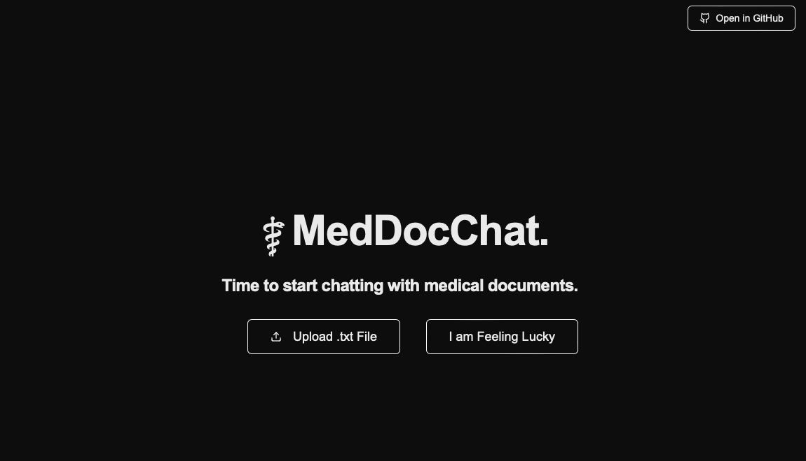

# ⚕️ MedDocChat

⚕️MedDocChat is a chatbot that allows you to converse with medical documents.

What ⚕️MedDocChat can do:<br>
✅ Answer questions about medical documents (in .txt files) in an intuitive chatbot interface<br>
✅ Provides source attribution 💡 from medical document, ensuring trust in chatbot<br>
✅ Stores medical documents in NoSQL distributed database (MongoDB is the only connection currently offered)<br>
✅ Maintains conversational history when chatting with document, allowing for context to be maintained

🛠️ Project's Tech Stack:

- Langchain
- FastAPI
- Next.Js
- MongoDB
- OpenAI

## Getting Started

1. Ensure that you have Node.js installed, which can be found on the [official website](https://nodejs.org/)

2. Clone this project onto your local machine

```
git clone https://github.com/will-pang/medical-document-chat
```

3. (Recommended) Using your terminal, `cd` into the project root folder, create a virtual environment:

```
python3 -m venv venv
source venv/bin/activate
```

Note that the latest Python version is required (as of writing, it is **Python 3.13.2**)

4. Install all the required Python packages

```
pip install -r requirements.txt
```

5. Install all the required Node.js packages

```
npm install
```

6. Create a `.env.local` file in the project root, with the following variables. You can also find an example under `docs\.env.example`:

```
MONGO_URI="YOUR_MONGODB_URI"
DB="YOUR_MONGO_DATABASE_NAME"
COLLECTION="YOUR_MONGO_COLLECTION_NAME"
OPENAI_API_KEY="YOUR_OPENAI_API_KEY"
CONVERSATIONAL_HISTORY_COLLECTION="YOUR_MONGODB_CONVERSATIONAL_HISTORY_COLLECTION_NAME"
```

7. In your IDE of choice, run the development server via the terminal:

```
npm run dev -- -p 3000
```

Open [http://localhost:3000](http://localhost:3000) with your browser to see the result.

8. In a separate terminal, run fastapi using Uvicorn:

```
uvicorn api.main:app --host 0.0.0.0 --port 8000 --reload
```

## Let's go (Chrome Recommended)!

1. Once everything is setup, you should be greeted by this landing page:
   

You can generate examples of medical documents on ChatGPT, or download some examples under `docs` and upload it (must be `.txt` format) by pressing the "Upload .txt File" button.

> **Note:** Currently, the "I'm Feeling Lucky" button is not supported. The idea was to pick a random example stored in the database of choice, but I did not have enough time to implement this.

2. Once the document is uploaded, you will be routed to a new page that displays the uploaded text, as well as a chatbot where you can start asking questions!
   
